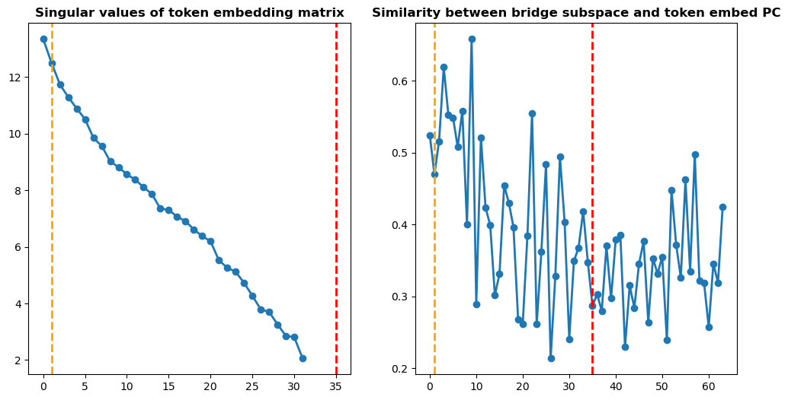

### Emergence of (nearly)-orthogonal subspaces
*Feb 9, 2025, Yiqiao Zhong*

**TL;DR** It is likely that the sharp transition in induction heads on the copying task is accompanied by the emergence of two nearly-orthogonal subspaces, and the two subspaces are functionally distinct and complementary: binding previous position vs. token matching.

**Description of finding**. In the plot

we take the token embedding matrix $W$ from 2-layer 1-head Transformer (TF) after 20,000 training steps. The singular values of $W$ contain a very large value, 35-ish medium ones, and remaining very small values. A plausible interpretation:
- Top singular subpsace: possibly related to formation of the previous-token head.
- Medium subpsace: repesenting token information
- Bottom subspace: representing other information

Then we calculate the bridge subspace, which is the top right singular subspace of $W_q W_k^\top$ from the 2nd TF layer. Intuitively it decides what information the 2nd head reads. This bridge subspace is correlated with the top and bottom subspaces, and nearly orthogonal to the medium subspace.

A plausible explanation: Before the transition, marginal distribution has little prediction effectiveness on OOD data. At the sharp transition, the model learns how to "control the information flow by learning these two functionally distinct subspaces", thus in a way representing the copying rule.

**More investigation to do.**
- Run the experiment and measure how these subspaces evolve
- How is sharpness increase connected to this observed geometry (perturbation analysis, ablation, etc.)
- How does the landscape change? Before the transition, does the model get trapped in a bad saddle point or local minima? What makes the model find the observed subspaces?
- A unified way of characterizing the composition by possibly generalizing the observed geometry? 

**Bigger picture to thing about.**

- Arithmetic and symbolic reasoning tasks. Empirical studies of positional encoding schemes, tricks to improve length generalization, robustness, etc.
- In-context learning and OOD generalization.
- Chain-of-thought and how complex math reasoning requries externalized composition.

**Some related research.**
- Incremental learning and staircase phenomenon (e.g., by Emmanuel Abbe's group). Analysis of sharp transtion but learning polynomials/subspaces one by one.
- Learning multi-index model by 2-layer NN (many people in learning theory, Bartlett, Jason Lee, Tengyu Ma, etc.). Analysis of stationary point. Connection between optimization and generalization.
- Hessian spectra and neural collapse. How do people explain stability and generalization? I can't remember much.

### Reasons for sharpness increase
*Feb 5, 2025, Yiqiao Zhong*

- **Reason 1**: Token embedding learns certain patterns, so that 1st-layer attention forms a previous-token head (attending to previous token). Interestingly, it requires 1st-layer attention to not use token embedding.
	- There is a line of papers on **length generalization**, e.g., this [DeepMind paper](https://arxiv.org/pdf/2402.09371), which observes the brittleness of positional encoding. It happens a lot on arithmetic tasks.
	- One of my papers ([link](https://arxiv.org/abs/2310.04861)) also observe the unsmoothness of positional embedding
- **Reason 2**: The 1st transformer layer needs to be aligned with the 2nd layer (namely subspace matching). It is possible, but seems less likely, that subspace matching requires increasing sharpness.
	- Subspace matching is connected to LoRA. Bin Yu has a [paper](https://arxiv.org/abs/2406.08447) on the stability of LoRA.
- **Something to do**: 
	- Locating the sharpness in the parameter space: which subset of parameters or subspaces are most sensitive to perturbations?
	- The impact of discrete nature of tasks (copying, arithmetics, algorithmic tasks, etc) on representation of positional information.